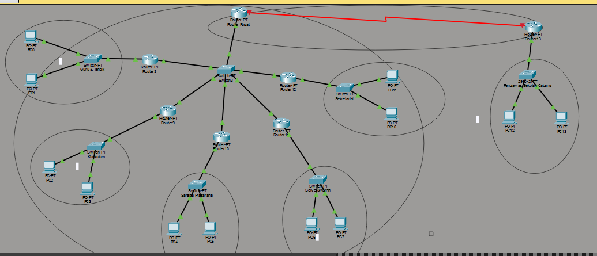

# Subnetting & Routing (Komunikasi Data dan Jaringan Komputer)

**Nama:** Zaenal Mustofa  
**NRP:** 5027241018  
**Base Network:** 10.58.0.0/16

## I. Analisis Kebutuhan Jaringan

Yayasan Pendidikan ARA membutuhkan jaringan yang dapat mengakomodasi kebutuhan host yang beragam di Kantor Pusat dan Kantor Cabang.

| Ruang | Lokasi | Kebutuhan Host Aktif (N) | Prefix VLSM |
| :--- | :--- | :--- | :--- |
| Sekretariat | Kantor Pusat | 380 | /23 |
| Bidang Kurikulum | Kantor Pusat | 220 | /24 |
| Bidang Guru & Tendik | Kantor Pusat | 95 | /25 |
| Bidang Sarana Prasarana | Kantor Pusat | 45 | /26 |
| Bidang Pengawas Sekolah | Kantor Cabang | 18 | /27 |
| Server & Admin | Kantor Pusat | 6 | /29 |

## II. Desain Topologi & Perangkat

Topologi dirancang menggunakan skema 7 Router (1 R-Pusat, 5 R-LAN, 1 R-Cabang) dengan R-Pusat mengatasi kendala port fisik menggunakan satu subnet Link (/28) yang terhubung ke Switch12.

### 1. Desain Topologi Jaringan

[Tambahkan Gambar Topologi dari Cisco Packet Tracer Anda di sini]


### 2. Alokasi Interface Router

| Router | Interface | Tujuan | Network VLSM | IP Address | Mask |
| :--- | :--- | :--- | :--- | :--- | :--- |
| **R-Pusat** | Fa0/0 | Link HQ-LANs | 10.58.3.240/28 | 10.58.3.241 | 255.255.255.240 |
| **R-Pusat** | S0/3/0 | Link HQ-Branch | 10.58.3.232/30 | 10.58.3.233 | 255.255.255.252 |
| **R13 (Cabang)** | Fa0/0 | LAN Cabang | 10.58.3.192/27 | 10.58.3.193 | 255.255.255.224 |
| **R13 (Cabang)** | S0/3/0 | Link HQ-Branch | 10.58.3.232/30 | 10.58.3.234 | 255.255.255.252 |
| **R8 (G&T)** | Gi0/0 | Link HQ-LANs | 10.58.3.240/28 | 10.58.3.242 | 255.255.255.240 |
| **R8 (G&T)** | Fa0/0 | LAN G&T | 10.58.3.0/25 | 10.58.3.1 | 255.255.255.128 |
| ... | ... | ... | ... | ... | ... |

## III. Perhitungan VLSM (Variable Length Subnet Mask)

Tabel VLSM menunjukkan pemecahan ruang alamat secara efisien tanpa *overlap*, diurutkan berdasarkan kebutuhan host (kecuali link antar-router).

| No. | Nama Subnet | Prefix | Network Address | Mask | Usable Host Range | Broadcast | Gateway (Router Interface IP) |
| :--- | :--- | :--- | :--- | :--- | :--- | :--- | :--- |
| 1 | Sekretariat | /23 | 10.58.0.0 | 255.255.254.0 | 10.58.0.1 - 10.58.1.254 | 10.58.1.255 | 10.58.0.1 |
| 2 | Kurikulum | /24 | 10.58.2.0 | 255.255.255.0 | 10.58.2.1 - 10.58.2.254 | 10.58.2.255 | 10.58.2.1 |
| 3 | Guru & Tendik | /25 | 10.58.3.0 | 255.255.255.128 | 10.58.3.1 - 10.58.3.126 | 10.58.3.127 | 10.58.3.1 |
| 4 | Sarana Prasarana | /26 | 10.58.3.128 | 255.255.255.192 | 10.58.3.129 - 10.58.3.190 | 10.58.3.191 | 10.58.3.129 |
| 5 | Pengawas Branch | /27 | 10.58.3.192 | 255.255.255.224 | 10.58.3.193 - 10.58.3.222 | 10.58.3.223 | 10.58.3.193 |
| 6 | Server & Admin | /29 | 10.58.3.224 | 255.255.255.248 | 10.58.3.225 - 10.58.3.230 | 10.58.3.231 | 10.58.3.225 |
| 7 | Link HQ-Branch | /30 | 10.58.3.232 | 255.255.255.252 | 10.58.3.233 - 10.58.3.234 | 10.58.3.235 | R-Pusat: 10.58.3.233 |
| 8 | Link HQ-LANs | /28 | 10.58.3.240 | 255.255.255.240 | 10.58.3.241 - 10.58.3.254 | 10.58.3.255 | R-Pusat: 10.58.3.241 |

## IV. Perhitungan CIDR (Classless Inter-Domain Routing)

CIDR (Supernetting) digunakan untuk mengurangi ukuran tabel routing di Router Cabang (R13) dengan merangkum semua LAN Kantor Pusat.

| Keterangan | Network | Prefix | Mask | Range Host | Broadcast |
| :--- | :--- | :--- | :--- | :--- | :--- |
| **Agregasi Kantor Pusat (HQ LANs)** | **10.58.0.0** | **/21** | **255.255.248.0** | 10.58.0.1 - 10.58.7.254 | 10.58.7.255 |

## V. Konfigurasi Static Routing

**Router Pusat (R-Pusat)**
Rute ke LAN Cabang (10.58.3.192/27) dan rute kembali ke 5 LAN melalui R-LAN:
```cli
ip route 10.58.3.192 255.255.255.224 10.58.3.234
ip route 10.58.3.0 255.255.255.128 10.58.3.242     ! Guru & Tendik (R8)
ip route 10.58.2.0 255.255.255.0 10.58.3.243       ! Kurikulum (R9)
ip route 10.58.3.128 255.255.255.192 10.58.3.244   ! Sarana (R10)
ip route 10.58.0.0 255.255.254.0 10.58.3.245       ! Sekretariat (R11)
ip route 10.58.3.224 255.255.255.248 10.58.3.246   ! Server & Admin (R12)
